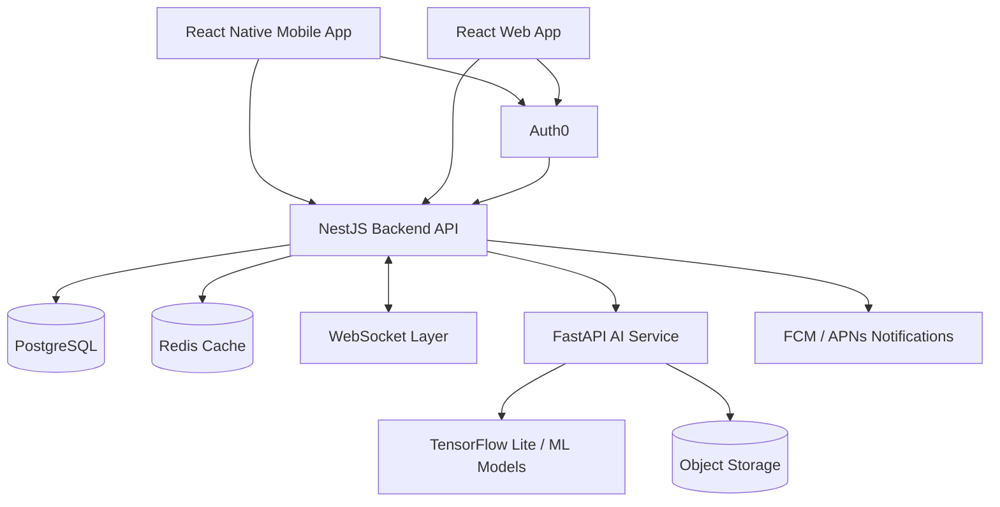

# High-Level Architecture

## Critical Data Flows
- **Personalised workout:** client -> NestJS -> workout data -> FastAPI AI -> recommendation -> PostgreSQL -> client.
- **Social sharing:** client -> NestJS -> privacy/access check -> PostgreSQL -> WebSocket/Redis -> approved users.
- **Nutrition tracking:** camera -> on-device analysis where practical -> FastAPI if needed -> user confirmation -> PostgreSQL.

## Security
- HTTPS/TLS for network traffic.
- Short-lived access tokens and MFA.
- Role-based access for sensitive functions.
- Secure token storage on mobile.
- Encryption for databases, backups and stored media.
- Input validation, rate limiting and audit logging.

## Scalability
- Stateless NestJS services can scale horizontally.
- FastAPI can scale separately for AI workloads.
- Redis supports caching and WebSocket event distribution.
- PostgreSQL indexes support common user, workout and social queries.
